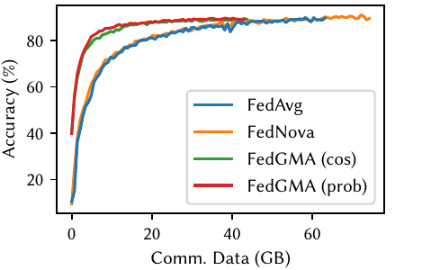

# FedGMA

This is the code of paper [Communication-Efficient Generalized Neuron Matching for Federated Learning](https://doi.org/10.1145/3605573.3605726)

## Requirements

System requirements:

* Openssh client & server
* Cmake & build essentials
* CUDA runtime >= 11.2
* Tmux >=3.2a

Python requirements:

* Python == 3.9
* Install all requirements with `pip install -r requirements.txt`.

## Usage

First edit `workers.txt` to configure the GPU resource allocation. Each line should have the format of `<server|client> localhost <N>`. `<N>` specifies the GPU index (starting from 0). The first line must be `server localhost <N>`, and the remaining lines must start with `client`. The total number of `client` lines must be greater than the total number of clients to start.

This is an example to run the code:

```bash
python -um code.launcher.client_server \
    +a fedavg +n 8 +sa -md.n unordered-resnet18 \
    -dt.r.d cifar10 -fl.bt model -fedavg.eslr 0.04 \
    -tr.bs 128 -tr.s.n reduceonplateau \
    -tr.o.sgd.wghtdcy 5e-4 -tr.e 10000 -tr.lr 0.05
```

This command starts a tmux session that manages all the processes of the experiment. To query all the available hyperparameters, run:

```bash
python -um code.launcher.node.node -l.a <algorithm>.server -h
```

where `<algorithm>` is the algorithm to run (i.e. `fedavg|fednova|fedgma`). The datasets will be downloaded if they are not already present after the experiment starts.

The processes are managed by tmux. Use `tmux attach` to attach to the tmux session and observe the progress of the experiment. Experiment logs will also be outputted to `logs/<date_time>`.


## Results

### Accuracies on CIFAR-10/100


|  |  |
|:--------------------------------------------:|:---------------------------------------------:|
| CIFAR10                                      | CIFAR100                                       |

### Accuracy -- Data Curve on CIFAR10
||||
|:----------------------------------:|:-------------------------------------:|:----------------------------------------:|
| VGG9                               | ResNet18                              | InceptionNet3                            |


## Citation

TBD
